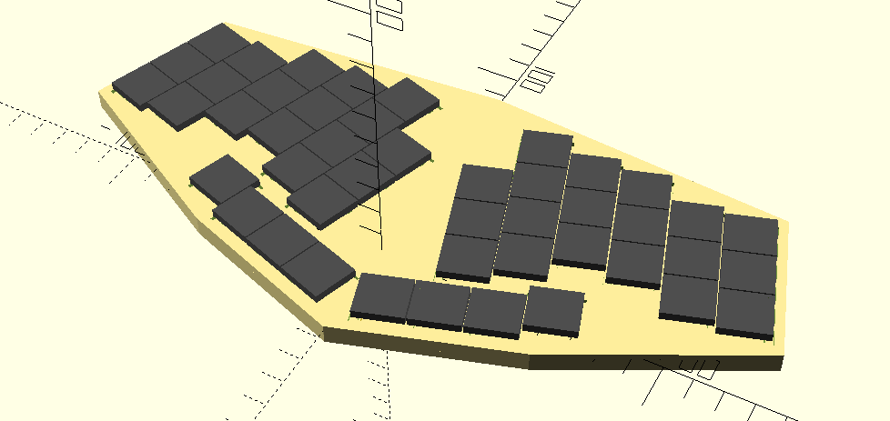
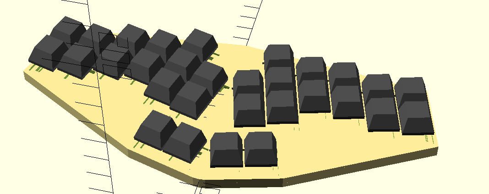
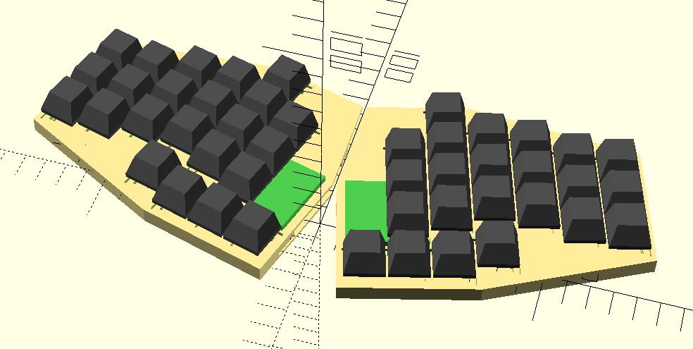
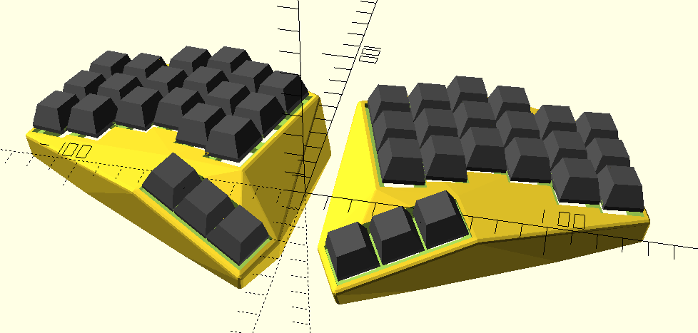

# Generating Keyboards with Clojure and OpenScad

[Redpoll](https://feierabendprojekte.wordpress.com/2024/01/13/my-new-travel-companion/)

Redpoll Steno (Work in Progress)

Redpoll Split (Work in Progress)

Mauersegler (Highly work in Progress)

3D printed, tented, split keyboard with keywells.

Uses Clojure and openscad-clj. Every .clj file is standalone.

This repo is inspired by the [Dactyl](https://github.com/adereth/dactyl-keyboard) and the [Dactyl Manuform](https://github.com/abstracthat/dactyl-manuform) projects (though no code was used). 

## License

Copyright © 2024 Azel4231

The source code for generating the models (everything excluding the [things/](things/) and [resources/](resources/) directories is distributed under the [GNU AFFERO GENERAL PUBLIC LICENSE Version 3](LICENSE).  The generated models and PCB designs are distributed under the [Creative Commons Attribution-NonCommercial-ShareAlike License Version 3.0](LICENSE-models).
